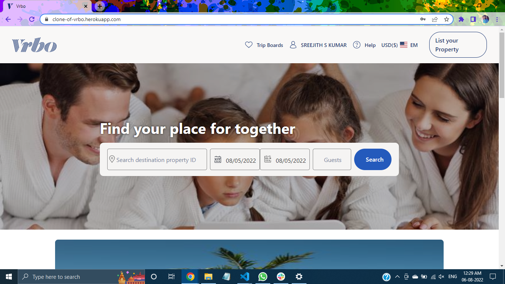

<h1>Vrbo Clone</h1>
 

<h3>Vrbo is a website which lets you search and book the perfect place to stay for you next vacation. A collaborative project built by 4 members in 7 days. </h3>
 
 
<h3>A collaborative project by a team of 4 members executed in 7 days </h3>
 
 
<h2>Feature Added: </h2>
 
 
<h3>->Signup and Login functionality</h3>
 
 
<h3>->Hotels search functionality</h3>
 
 
<h3>->Hotels Result Page</h3>
 
 
<h3>->Checkout Page</h3>
 
 
<h3>->Payment Page</h3>
 
 
<h3>->Hotel Booking Status Page</h3>
 
 
<h3>The tech stack used are React JS, Node JS, MongoDB, Express JS, Chakra UI, Styled Components</h3>
 
 
 
Deployed Link for our website :https://clone-of-vrbo.herokuapp.com/